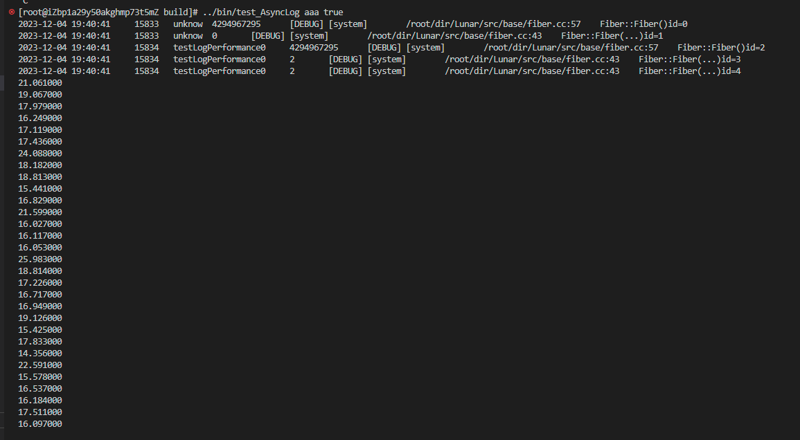
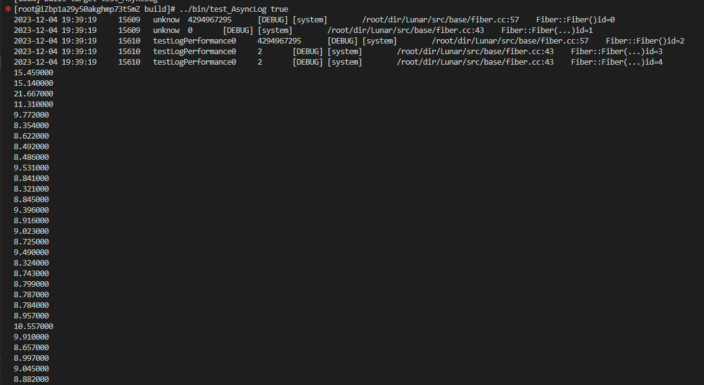

# 简介

**前言**

lunar是是精简版的sylar，作者重写了sylar的base模块。

sylar是一个基于协程的服务器框架。同go语言思想一样，整个框架贯彻协程化的思想，淡化线程的存在。笔者有幸反复阅读sylar数次，并重写过base核心模块。该项目是我真正入门C++的第一个项目，我也将其作为本科毕设，顺利通过答辩。非常感谢sylar的作者能将多年从业经验浓缩在这个项目当中，这真的是为后来者点了一扇关键的灯。

# To Start

**开发环境参考如下表：**

|   环境    |   版本    |
|   :---:   |   :---:   |
|   Linux操作系统   |   CentOS 7.5 64位（2核2G） |
|   G++编译器	    |   4.8.5   |
|   CMake	        |   3.14.5  |
|   C++标准	        |   C++11   |
|   项目调试工具	|   GDB     |
|   项目开发工具	|   VSCode  |

**下载、编译、试玩重写的简化版sylar：**

去除了sylar原来的负载均衡、数据库连接、protobuff、orm、zk等模块。（实际上是太菜了，这些模块没跟下去。）

```bash
#源码下载
git clone https://github.com/LunarStore/lunar.git 

# 安装boost库
yum install boost-devel # boost库

# 安装yaml-cpp（可能需要升级cmake
git clone https://github.com/jbeder/yaml-cpp.git
cd yaml-cpp
mkdir build && cd build
cmake .. && make -j
sudo make install

# 创建build目录
cd lunar
mkdir build
cd build

# 在build目录生成makefile文件
cmake ..

# 编译
make -j2

# 建立一个必要目录
# 否则会报错：
# 2024-01-28 05:01:06	[ERROR]	[system]	/root/workspace/lunar/src/init/application.cc:116	open pidfile /apps/work/lunar/lunar.pid failed
mkdir -p /apps/work/lunar

# 终端运行，让网站跑起来
../bin/test_application -s
```

# V0.0.2

**本项目搭建的服务器运行在：[网址](http://47.99.79.135:8090/index)**

## 更新点  --2023.7.3

1. 实现了一下对日志的配置。

2. 参考Muduo，对Thread模块的封装进行了改进与完善。

3. 对于Fiber模块，在所有从当前协程切换到其他协程的操作中使用裸指针切换，解决了临时智能指针占用引用计数导致Fiber对象无法释放的问题。

4. 对于Mutex模块，对pthread_mutex_lock相关的操作函数增加了断言操作，并发现程序析构时发生段错误。

5. Schedule::run()函数中对取任务/协程操作进行了封装，封装成takeTask成员函数。通过排查，在run函数结束时，将t_scheduler赋值为nullptr，并且调用set_hook_enable(false)，解除hook，4中描述的段错误问题被解决。

6. IOManager::idle()中利用(EPOLLIN | EPOLLOUT) & fdctx->m_events) 掩码读取epoll触发的事件，消除了m_penddingEventCount--可能为负的潜在bug。

7. Timer类中增加了必要的断言。

## 更新点 --2023.12.1

1. 增加了基于协程的信号量，为后续实现协程异步日志打基础。

2. 发现了之前编译出现"class “xxxx“ does not name a type"错误的原因，类的设计存在循环引用的问题，目前暂时使用指针解决，待后面将解决方案完善。

## 更新点 --2023.12.4

1. 实现了基于协程的异步日志，将日志的输出效率提升了近一倍。

    - 同步日志性能测试如下：

    

    - 异步日志性能测试如下：

    

2. 后面计划优化服务器的性能，然后实现一些简单的负载均衡、orm、rock等模块。